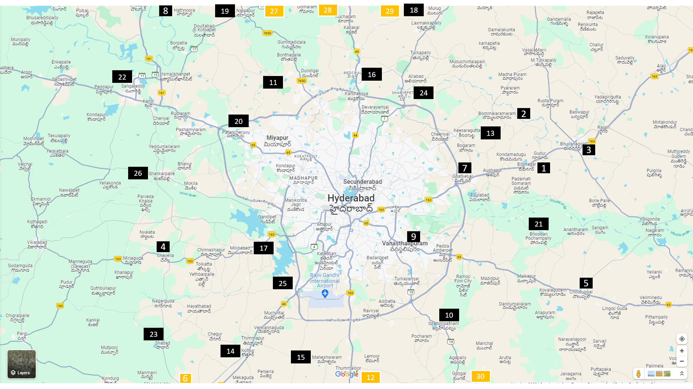

# HDMA Master Plan 2031

| Sl# | District                       | Quick Facts | Master Plan |
| --- | ------------------------------ | ----------- | ----------- |
| 1 | BIBINAGAR | Bibinagar is a Mandal in Yadadri Bhuvanagiri district of the Indian state of Telangana. It is located in Bibinagar mandal of Bhongir revenue division. It is famous for All India Institute of Medical Sciences, Bibinagar. 39 km from Hyderabad. | <a href="https://masterplan.hmda.gov.in/Masterplan2031/Content/BIBINAGAR.jpg" target="_blank">HDMA</a>  <a href="./map-images/BIBINAGAR.jpg" target="_blank">Local</a> 
| 2 | BOMMALARAMARAM | Bommalaramaram is a village in Yadadri Bhuvanagiri district of the Indian state of Telangana. It is located in Bommalaramaram mandal of Bhongir division, Also a part of Hyderabad Metropolitan Region and Also RRR going through this area, Yadagirigutta New Bypass 4 Lanes road also pass from here. | <a href="https://masterplan.hmda.gov.in/Masterplan2031/Content/BOMMALARAMARAM.jpg" target="_blank">HDMA</a>  <a href="./map-images/BOMMALARAMARAM.jpg" target="_blank">Local</a> 
| 3 | BUVANAGIRI | Bhongir, officially known as Bhuvanagiri, is a city and a district headquarters of the Yadadri Bhuvanagiri district and part of the Hyderabad Metropolitan Region of the Indian state of Telangana. | <a href="https://masterplan.hmda.gov.in/Masterplan2031/Content/BUVANAGIRI.jpg" target="_blank">HDMA</a>  <a href="./map-images/BUVANAGIRI.jpg" target="_blank">Local</a> 
| 4 | CHEVELLA | Chevella is a town, mandal and suburb of Hyderabad in Ranga Reddy district of the Indian state of Telangana. It is the headquarters of surrounding villages with many government establishments like Judicial court, Revenue Division Office, Acp office under Cyberabad Metropolitan Police. | <a href="https://masterplan.hmda.gov.in/Masterplan2031/Content/CHEVELLA.jpg" target="_blank">HDMA</a>  <a href="./map-images/CHEVELLA.jpg" target="_blank">Local</a> 
| 5 | CHOUTUPPAL | Choutuppal is a census town in Yadadri Bhuvanagiri district of the Indian state of Telangana. It is located in Choutuppal mandal of Choutuppal division. Its part of Hyderabad Metropolitan Development Authority. 49 km from Hyderabad. | <a href="https://masterplan.hmda.gov.in/Masterplan2031/Content/CHOUTUPPAL.jpg" target="_blank">HDMA</a>  <a href="./map-images/CHOUTUPPAL.jpg" target="_blank">Local</a> 
| 6 | FAROOQNAGAR | Farooqnagar is a census town in Ranga Reddy district of the Indian state of Telangana. | <a href="https://masterplan.hmda.gov.in/Masterplan2031/Content/FARUQNAGAR.jpg" target="_blank">HDMA</a>  <a href="./map-images/FARUQNAGAR.jpg" target="_blank">Local</a> 
| 7 | GHATKESAR |  | <a href="https://masterplan.hmda.gov.in/Masterplan2031/Content/GHATKESAR.jpg" target="_blank">HDMA</a>  <a href="./map-images/GHATKESAR.jpg" target="_blank">Local</a> 
| 8 | HATNURA |  | <a href="https://masterplan.hmda.gov.in/Masterplan2031/Content/HATNURA.jpg" target="_blank">HDMA</a>  <a href="./map-images/HATNURA.jpg" target="_blank">Local</a> 
| 9 | HAYATHNAGAR | Hayathnagar is a busy residential locality Hyderabad in Ranga Reddy district of the Indian state of Telangana, pincode 500070 & 501505. It is Mandal headquarter of Hayathnagar mandal of Hayathnagar revenue division. Hayathnagar forms circle No 3 in Greater Hyderabad Municipal Corporation. | <a href="https://masterplan.hmda.gov.in/Masterplan2031/Content/HAYATHNAGAR.jpg" target="_blank">HDMA</a>  <a href="./map-images/HAYATHNAGAR.jpg" target="_blank">Local</a> 
| 10 | IBRAHIMPATNAM MANCHAL | Ibrahimpatnam is a suburb of Hyderabad in Ranga Reddy district of the Indian state of Telangana. It is located in Ibrahimpatnam mandal of Ibrahimpatnam revenue division. | <a href="https://masterplan.hmda.gov.in/Masterplan2031/Content/IBRAHIMPATNAM MANCHAL.jpg" target="_blank">HDMA</a>  <a href="./map-images/IBRAHIMPATNAM MANCHAL.jpg" target="_blank">Local</a> 
| 11 | JINNAWARAM_FPLU | Jinnaram is a town and Mandal headquarters in Sangareddy district of Telangana, India. | <a href="https://masterplan.hmda.gov.in/Masterplan2031/Content/JINNAWARAM_FPLU.jpg" target="_blank">HDMA</a>  <a href="./map-images/JINNAWARAM_FPLU.jpg" target="_blank">Local</a> 
| 12 | KANDUKUR | Kandukur is a village in Ranga Reddy district of the Indian state of Telangana. It is located in Kandukur mandal of Kandukur revenue division. | <a href="https://masterplan.hmda.gov.in/Masterplan2031/Content/KANDUKUR.jpg" target="_blank">HDMA</a>  <a href="./map-images/KANDUKUR.jpg" target="_blank">Local</a> 
| 13 | KISARA | Keesaragutta | <a href="https://masterplan.hmda.gov.in/Masterplan2031/Content/KISARA.jpg" target="_blank">HDMA</a>  <a href="./map-images/KISARA.jpg" target="_blank">Local</a> 
| 14 | KOTHURU |  | <a href="https://masterplan.hmda.gov.in/Masterplan2031/Content/KOTHURU.jpg" target="_blank">HDMA</a>  <a href="./map-images/KOTHURU.jpg" target="_blank">Local</a> 
| 15 | MAHESHWARAM | Maheswaram is a village and mandal in Ranga Reddy district in the state of Telangana, India. | <a href="https://masterplan.hmda.gov.in/Masterplan2031/Content/MAHESHWARAM.jpg" target="_blank">HDMA</a>  <a href="./map-images/MAHESHWARAM.jpg" target="_blank">Local</a> 
| 16 | MEDCHAL_QUTUBULLAPUR | Medchal is a Outer Suburb of Hyderabad in the Medchal–Malkajgiri district of the Indian state of Telangana. It is the mandal headquarters of Medchal mandal in Keesara revenue division of the district. It also forms a part of Hyderabad Metropolitan Development Authority. | <a href="https://masterplan.hmda.gov.in/Masterplan2031/Content/MEDCHAL_QUTUBULLAPUR.jpg" target="_blank">HDMA</a>  <a href="./map-images/MEDCHAL_QUTUBULLAPUR.jpg" target="_blank">Local</a> 
| 17 | MOINABAD_RAJENDRANAGAR |  | <a href="https://masterplan.hmda.gov.in/Masterplan2031/Content/MOINABAD_RAJENDRANAGAR.jpg" target="_blank">HDMA</a>  <a href="./map-images/MOINABAD_RAJENDRANAGAR.jpg" target="_blank">Local</a> 
| 18 | MULUG | Mulug is a Mandal in Siddipet district of Telangana State, India.  The villages in Mulug mandal includes:Narsampally, Achaipalle, Aliabad, Annasagar, Bahilampur, Banda Mailaram, Baswapuram, Chinnathimapur, Dasarlapalle, Gangadharapalle, Kasireddypally, Ksheerasagar, Vagunoothi, Vantimamidi, Kamalabad, Kokkonda, Kolthur, Kotiyal, Lakshmakkapalle, Mamidiyal, Mulug, Nagireddypalle, Narsapur, Singannagudem, Surampur, Tunkibollaram, Zapthisingaipalle etc. | <a href="https://masterplan.hmda.gov.in/Masterplan2031/Content/MULUG.jpg" target="_blank">HDMA</a>  <a href="./map-images/MULUG.jpg" target="_blank">Local</a> 
| 19 | NARSAPUR | Narsapur formally Gandi Narsapuram, is a census town in Medak district of the Indian state of Telangana. It is located in Narsapur mandal. Narsapur is a Municipality. Narsapur is located 50 km from Hyderabad | <a href="https://masterplan.hmda.gov.in/Masterplan2031/Content/NARSAPUR.jpg" target="_blank">HDMA</a>  <a href="./map-images/NARSAPUR.jpg" target="_blank">Local</a> 
| 20 | PATANCHERUVU | Patancheruvu is located in the north western end of Hyderabad. It is an industrial zone located about 32 km from the city centre on the Hyderabad-Solapur highway, and around 18 km from HITEC City. Earlier, it was the headquarters of Bidar and Gulshanabad revenue divisions. | <a href="https://masterplan.hmda.gov.in/Masterplan2031/Content/PATANCHERUVU.jpg" target="_blank">HDMA</a>  <a href="./map-images/PATANCHERUVU.jpg" target="_blank">Local</a> 
| 21 | POCHAMPALLI | Bhoodan Pochampally is a census town in the Yadadri Bhuvanagiri district of the Indian state of Telangana. It is located in Pochampalle mandal of Bhongir division. This village is Known for woven products, especially hand-woven Ikkat sarees. | <a href="https://masterplan.hmda.gov.in/Masterplan2031/Content/POCHAMPALLI.jpg" target="_blank">HDMA</a>  <a href="./map-images/POCHAMPALLI.jpg" target="_blank">Local</a> 
| 22 | SANGAREDDY | Sangareddy, formally Sangareddipet is a city and district headquarters of the Sangareddy district in the Indian state of Telangana. It was named after the ruler Sanga, who was the son of Rani Shankaramba, a ruler of Medak during the Nizam era. | <a href="https://masterplan.hmda.gov.in/Masterplan2031/Content/SANGAREDDY.jpg" target="_blank">HDMA</a>  <a href="./map-images/SANGAREDDY.jpg" target="_blank">Local</a> 
| 23 | SHAHBAD | Shabad is a town and a mandal in Ranga Reddy district in the state of Telangana in India. Its name is sometimes written as Shahabad. It is situated about 45 km from Hyderabad, the state capital. | <a href="https://masterplan.hmda.gov.in/Masterplan2031/Content/SHAHBAD.jpg" target="_blank">HDMA</a>  <a href="./map-images/SHAHBAD.jpg" target="_blank">Local</a> 
| 24 | SHAHMIRPET | Shamirpet is a major revenue village panchayat, and also a suburb of Hyderabad city and district headquarters of Medchal-Malkajgiri district of the Indian state of Telangana. It is also the mandal headquarter of Shamirpet mandal in Keesara revenue division. | <a href="https://masterplan.hmda.gov.in/Masterplan2031/Content/SHAHMIRPET.jpg" target="_blank">HDMA</a>  <a href="./map-images/SHAHMIRPET.jpg" target="_blank">Local</a> 
| 25 | SHAMSHABAD |  | <a href="https://masterplan.hmda.gov.in/Masterplan2031/Content/SHAMSHABAD.jpg" target="_blank">HDMA</a>  <a href="./map-images/SHAMSHABAD.jpg" target="_blank">Local</a> 
| 26 | SHANKARPALLI_RAMCHANDRAPURAM | Shankarpalli is a town in Ranga Reddy district of the Indian state of Telangana. It falls under Shankarpalli mandal of Chevella revenue division. | <a href="https://masterplan.hmda.gov.in/Masterplan2031/Content/SHANKARPALLI_RAMCHANDRAPURAM.jpg" target="_blank">HDMA</a>  <a href="./map-images/SHANKARPALLI_RAMCHANDRAPURAM.jpg" target="_blank">Local</a> 
| 27 | SHIVAMPET | Shivampet or Shivampeta is a Mandal in Sangareddy district of Telangana, India. | <a href="https://masterplan.hmda.gov.in/Masterplan2031/Content/SHIVAMPET.jpg" target="_blank">HDMA</a>  <a href="./map-images/SHIVAMPET.jpg" target="_blank">Local</a> 
| 28 | TUPRAN | Toopran is a revenue division in the Medak district of Telangana, India. Geographically located on the west and south banks of Haldi River. Haldi River also called by Pasupuleru, Haridranadi, kondavagu, Toorpurani etc names. Toopran word is metamorphic change of Toorpurani. | <a href="https://masterplan.hmda.gov.in/Masterplan2031/Content/TUPRAN.jpg" target="_blank">HDMA</a>  <a href="./map-images/TUPRAN.jpg" target="_blank">Local</a> 
| 29 | WARGAL |  | <a href="https://masterplan.hmda.gov.in/Masterplan2031/Content/WARGAL.jpg" target="_blank">HDMA</a>  <a href="./map-images/WARGAL.jpg" target="_blank">Local</a> 
| 30 | YACHARAM | Yacharam is a village in Ranga Reddy district of the Indian state of Telangana. It is located in Yacharam mandal of Ibrahimpatnam revenue division. The Yacharam Police Station is a part of the law and order of the region. | <a href="https://masterplan.hmda.gov.in/Masterplan2031/Content/YACHARAM.jpg" target="_blank">HDMA</a>  <a href="./map-images/YACHARAM.jpg" target="_blank">Local</a> 

### Location in Map 

